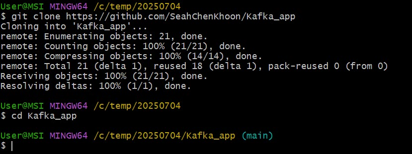
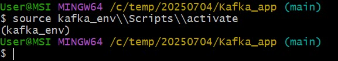
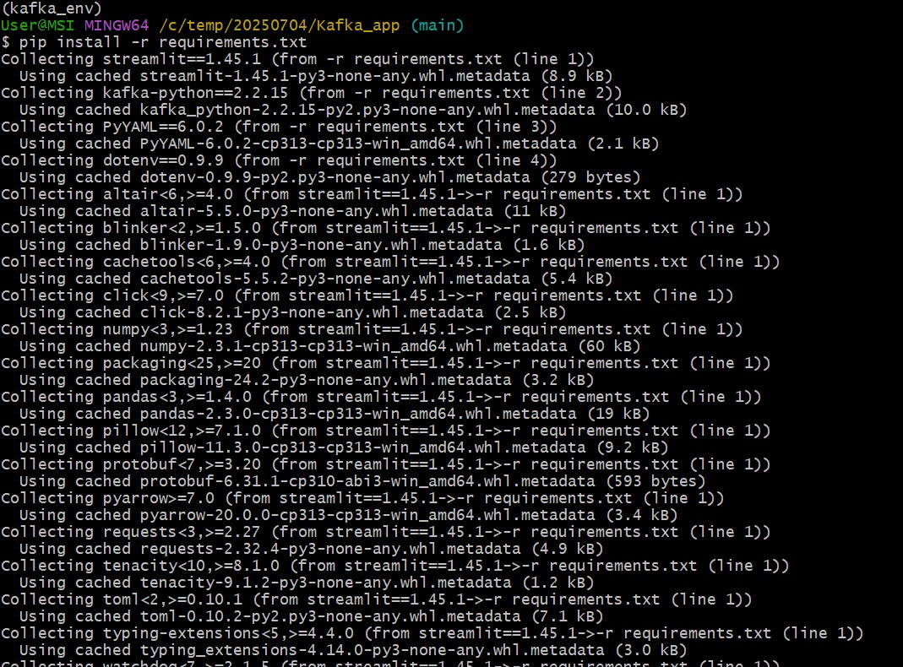
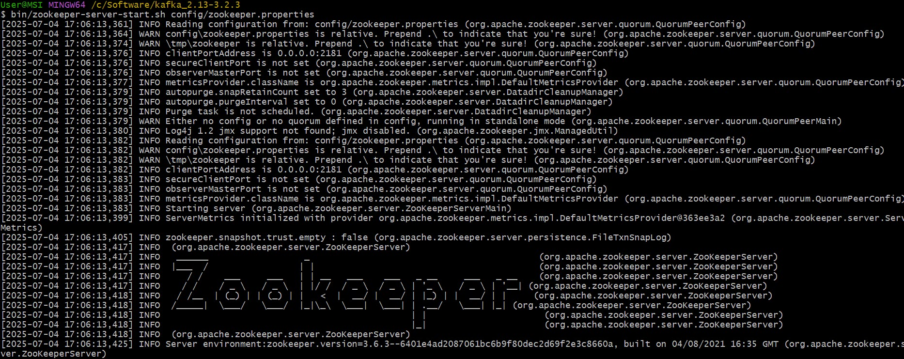
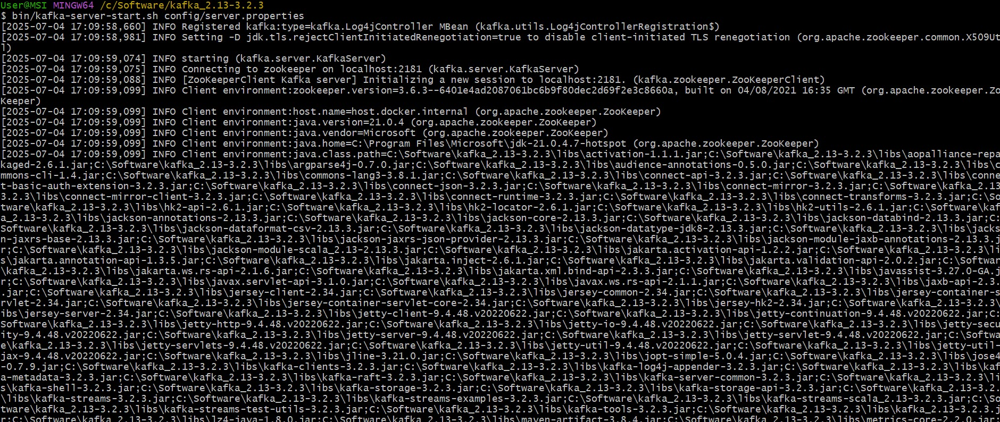
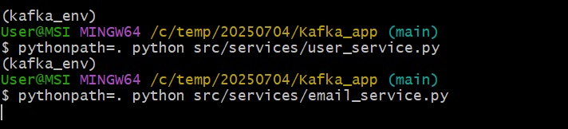
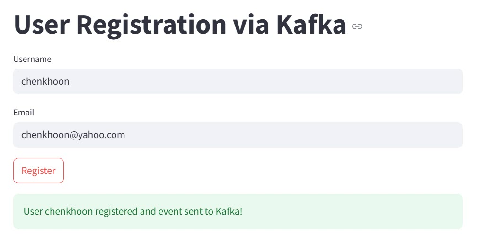
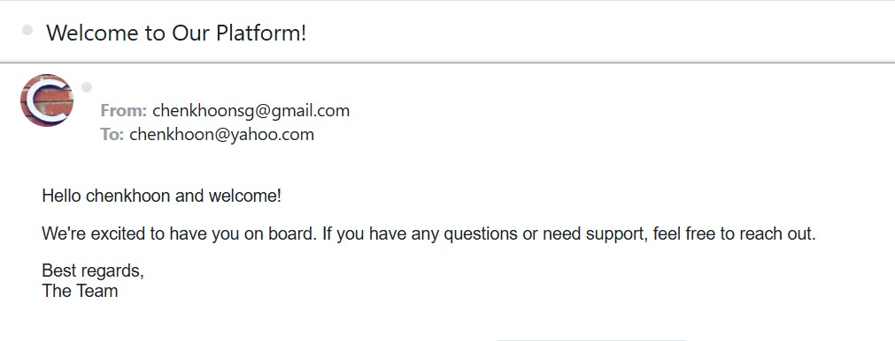

# Project Title
Event-Driven User Notification System

# Description
Developed an event-driven microservice architecture using Apache Kafka and Python to automate user onboarding notifications. Implemented a `User Service` that publishes `user_created` events and an `Email Service` that consumes these events to send dynamic welcome emails using SMTP. Integrated YAML-based templates for flexible message customization. Explored containerization with Docker and deployment via WSL2 and Azure Container Instances. Gained hands-on experience in asynchronous communication, Kafka topic management, and service orchestration.

# Prerequisites
- Python 3.8+: Required to run the producer and consumer services.
- Kafka-Python library: For interacting with Kafka topics and events (`pip install kafka-python`).
- Apache Kafka & Zookeeper: A running Kafka broker is needed to enable event publishing and consumption.
- SMTP-compatible Email Account: Used by the Email Service to send welcome emails (e.g., Gmail with App Password).
- WSL2: Recommended for Linux-compatible Kafka and Docker environments.

# Installation
## 1. Clone the repository:
- git clone https://github.com/SeahChenKhoon/Kafka_app
- cd Kafka_app



## 2. Create a virtual environment
``` bash
python -m venv venv
```


## 3. Activate the virtual environment
- On Windows
```bash
venv\\Scripts\\activate
```
- Or On Mac
```bash
source venv/bin/activate
```



## 4. Install libraries
```
pip install -r requirements.txt
```



## 5. Configure .env
```
cp example.env .env
```
In .env file, set the following values:
```
CONFIG_PATH = "config/kafka_config.yaml"
SENDER_EMAIL = "XXXX@gmail.com"
PASSWORD = "abcs"
BOOTSTRAP_SERVER = "localhost:9092"
```

## 6. Manual Kafka Setup

- Download Kafka: https://kafka.apache.org/downloads
- Terminal 1 — Start Zookeeper:
```
bin/zookeeper-server-start.sh config/zookeeper.properties
```



- Terminal 2 — Start Kafka:
```
bin/kafka-server-start.sh config/server.properties
```



## 7. Run the Services
- Terminal 3 —  Start the Kafka Producer:
```
pythonpath=. python src/services/user_service.py

pythonpath=. python src/services/email_service.py
```


## 8. Run streamlit
- Terminal 4 —  Run the app:
```
pythonpath=. streamlit run src/user_streamlit_app.py
```




